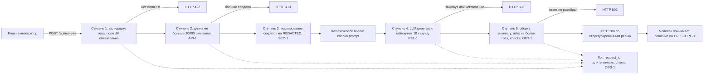

# ADR: решение для первого рабочего сценария

- Статус: proposed
- Дата: 2026-09-04
- Ответственные: автор практики (роль «инженер-аналитик») готовит и поддерживает решение; приёмку выполняет человек-ревьюер согласно SCOPE-1. Персональный состав в источниках практики не зафиксирован — имена не подставляются, это допущение.

## Контекст

Решение нужно сейчас, потому что в диффе появился публичный вход во внешний LLM, а обвязки вокруг него нет ни одной. В хунке `app/api.py @@ -1,8 +1,17 @@` обработчик состоит из строки `return review_service.review(payload["diff"])`: тело запроса не описано схемой, длина диффа не проверяется. В хунке `app/review_service.py @@ -1,10 +1,23 @@` метод собирает `prompt = f"Review this pull request and find problems:\n{diff}"` и вызывает `answer = self.llm.generate(prompt)`, после чего возвращает `{"comment": answer}`. Строк с маскированием, таймаутом, `try/except` и логированием в приведённых хунках нет — это вывод об отсутствии, а не цитата.

Каждый из этих пробелов бьёт по своему правилу: дифф уходит провайдеру дословно (SEC-1), длина не ограничена (API-1), вызов без таймаута и без обработки ошибок (REL-1), ответ — одна строка вместо `summary`/`risks`/`checks` (OUT-1), логирования нет, поэтому соблюдение OBS-1 нечем подтвердить. Откладывать решение нельзя именно из-за SEC-1: маршрут уже принимает произвольный дифф, и первый же реальный запрос с приватным ключом отправит его наружу необратимо.

## Решение

Ввести один синхронный конвейер обработки `POST /api/reviews` с пятью обязательными ступенями до и после внешнего вызова; порядок ступеней — часть решения, а не деталь реализации.

1. **Валидация тела на границе HTTP.** Тело описывается схемой запроса с обязательным строковым полем `diff`; отсутствие или неверный тип поля даёт 422 до обращения к `ReviewService`. Это снимает `KeyError` из `payload["diff"]`.
2. **Отсечение по длине до внешнего вызова.** Дифф длиннее 20 000 символов отклоняется с 413 (API-1). Проверка стоит до маскирования и до `generate`, чтобы длинный дифф не расходовал ни процессорное время на регулярные выражения, ни бюджет провайдера.
3. **Маскирование секретов перед сборкой промпта.** Токены, пароли и приватные ключи заменяются на `[REDACTED]` в тексте диффа, и только очищенный текст подставляется в `prompt` (SEC-1). Ступень стоит строго перед формированием промпта — это единственная точка, где дифф ещё не покинул контур.
4. **Вызов LLM с таймаутом 10 секунд и контролируемым отказом.** `generate` вызывается под таймаут из REL-1; исключение провайдера и срабатывание таймаута дают клиенту 503 без трассировки и без имени провайдера.
5. **Сборка ответа по схеме OUT-1.** Ответ модели разбирается в `{"summary", "risks", "checks"}`, где `risks` — не более трёх элементов с полями `file`, `line`, `evidence`, `risk`; риск без `evidence` отбрасывается (QA-1), неразобранный ответ модели даёт 502. Сервис остаётся советующим: он не пишет код и не действует в GitHub (SCOPE-1).

Сквозным для всех ступеней остаётся логирование по OBS-1: `request_id`, длительность, статус — и ничего из содержимого диффа и ответа модели.

Из перечисленных кодов ответа правилами задан только один: API-1 прямо требует HTTP 413 для диффа длиннее 20 000 символов. Коды 422 для невалидного тела, 503 для отказа и таймаута провайдера и 502 для неразобранного ответа модели — проектное решение этой работы: REL-1 требует «контролируемый ответ», но кода не называет, а для валидации тела и для разбора ответа правила кода не задают вовсе. Решение зафиксировано здесь, чтобы во всех остальных артефактах и тестах эти коды использовались согласованно; при пересмотре менять их нужно одновременно в `analysis.md`, `product_management.md` и четырёх файлах тестов.

## Рассмотренные альтернативы

| Альтернатива | Почему не выбрали сейчас |
|---|---|
| Асинхронная очередь: `POST /api/reviews` кладёт задачу в очередь, возвращает 202 и `task_id`, клиент забирает результат отдельным запросом | Снимает риск блокировки воркера длинным вызовом, но меняет контракт, который в диффе уже зафиксирован как синхронный: `create_review` возвращает `dict[str, str]` прямо из `review_service.review(...)`. Клиенту пришлось бы реализовать опрос, а самому сервису — хранилище состояния задач, чего в диффе нет вовсе. При этом ни одно из семи правил очередь не закрывает: SEC-1, API-1, OUT-1 и OBS-1 в асинхронной схеме требуют ровно тех же ступеней, а REL-1 задаёт таймаут в 10 секунд, то есть допускает синхронное ожидание. Очередь понадобится, когда P95 из `tests_load.md` устойчиво упрётся в таймаут при целевом RPS — до этого замера она добавляет компонент без покрытия правила |
| Довериться контуру: не маскировать секреты, а разместить провайдера LLM внутри доверенного периметра и запретить внешних провайдеров политикой | Дешевле в коде и не даёт ложных срабатываний маскирования на легитимном тексте диффа. Но SEC-1 сформулировано как требование к данным («перед отправкой во внешний LLM из diff удаляются токены, пароли, приватные ключи»), а не к сетевому периметру, и дифф оставляет провайдера абстракцией — `class LLM(Protocol)` с методом `generate`, реализация в дифф не входит. Значит, гарантия периметра не проверяется ни одной строкой этого PR, а маскирование проверяется unit-тестом на перехваченном `prompt`. Выбрана проверяемая гарантия вместо организационной |
| Оставить `{"comment": str}` и разбирать текст ответа на стороне клиента | Не требует менять сервис и сохраняет уже написанный `return {"comment": answer}`. Но переносит соблюдение OUT-1 на каждого клиента отдельно: правило требует `risks` не более трёх с четырьмя полями, а гарантировать это может только та сторона, которая видит ответ модели целиком. Отбор по QA-1 (риск без `evidence` отбрасывается) на клиенте тоже невоспроизводим — у него нет исходного диффа для сверки. Формат ответа остаётся ответственностью сервиса |
| Ограничить длину диффа не проверкой, а усечением до 20 000 символов | Клиент всегда получает 200, отказов нет. Но API-1 требует именно отклонения с HTTP 413, а усечение молча меняет предмет ревью: модель анализирует часть диффа, а `risks` со ссылками `file`/`line` указывают на строки, которых в проанализированном тексте не было. Это прямо противоречит QA-1, потому что evidence перестаёт соответствовать входу |

## Последствия и главный риск

- Положительные последствия: ошибка клиента (422, 413) отделена от отказа сервиса (503, 502), и обе перестают выглядеть как 5xx; секрет из диффа не покидает контур в открытом виде; воркер освобождается не позже ~10 секунд; ответ становится машиночитаемым, поэтому CI-клиент может завести проверку на содержимое `risks`, а ревьюер получает готовый список вместо сплошного текста; лог по OBS-1 даёт длительность и статус, то есть появляется чем измерять метрики из `problem.md`.
- Ограничения: сервис остаётся синхронным, поэтому пропускная способность ограничена числом воркеров, умноженным на время ответа провайдера — при таймауте 10 с это верхняя граница; маскирование работает по шаблонам известных категорий секретов и не распознаёт произвольный формат; схема OUT-1 требует, чтобы ответ модели поддавался разбору, поэтому появляется новый класс отказа (502), которого в AS IS не было; ограничение в 20 000 символов делает часть больших PR непроверяемыми через этот маршрут — это осознанное следствие API-1.
- Главный риск: маскирование по шаблонам пропускает секрет нестандартного формата, и он уходит провайдеру. Риск остаётся даже при полностью выполненном решении, потому что ступень 3 закрывает известные категории, а не все возможные; цена срабатывания необратима — отправленное наружу не отзывается.
- Как проверим риск: unit-проверкой U-2 из `tests_unit.md` на наборе диффов с разными формами секретов — проверяется, что в перехваченном аргументе `prompt` стоит `[REDACTED]` и отсутствует само значение; набор шаблонов ведётся как список, каждый пропуск, найденный на приёмке, добавляется в него новым случаем. Дополнительно integration-проверка I-6 подтверждает, что секрет не утекает вторым путём — через логи. Полноту набора шаблонов принимает человек (SCOPE-1): автоматическая проверка показывает только то, что известные категории закрыты, и никогда — что неизвестных не осталось.

## Архитектурная схема

## Как использовали AI

- Для чего: собрать одно решение, закрывающее валидацию, маскирование, таймаут и схему ответа, и честно разобрать альтернативы, которые действительно рассматривались.
- Тип промпта: master prompt (P1-03).
- Строка в [`prompts.md`](prompts.md): P1-03.
- Что проверили и исправили сами: проверили по диффу утверждение «текущий контракт синхронный», на котором держится отказ от очереди, — оно следует из строки `return review_service.review(payload["diff"])` в обработчике, объявленном как `def`, а не `async def`. Исправили черновую формулировку отказа от альтернатив: вместо «очередь избыточна» записали конкретное условие, при котором она понадобится (P95 упирается в таймаут при целевом RPS). Отбросили как недоказуемую альтернативу «кэширование ответов по хешу диффа» — ни одно правило её не мотивирует, а фактов о повторяемости запросов в источниках нет. Порядок ступеней 2 и 3 (отсечение до маскирования) выбран осознанно и зафиксирован в решении, потому что обратный порядок прогонял бы регулярные выражения по диффу, который всё равно будет отклонён. Отдельно перепроверили происхождение кодов ответа: по `CASE.md` правилами задан только 413 (API-1), поэтому 422, 502 и 503 отмечены в решении как выбор этой работы, а не как следствие правил — раньше они подавались наравне с 413 и выглядели как требование источника.
