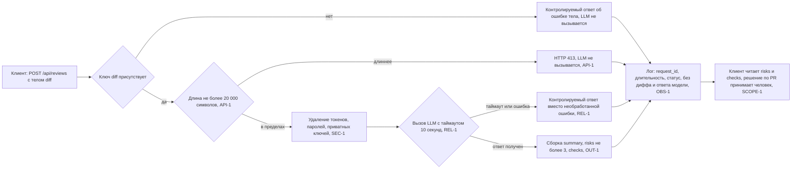

# Анализ процесса: AS IS и TO BE

Разбирается один сквозной сценарий `POST /api/reviews`. Источник фактов — хунки `app/api.py @@ -1,8 +1,17 @@` и `app/review_service.py @@ -1,10 +1,23 @@`; правила названы по ID (формулировки — в [`context.md`](context.md), раздел «Факты и правила»).

## AS IS

Участники: клиент (автор PR или ревьюер), FastAPI-приложение (`app = FastAPI()`), `ReviewService` из `app.dependencies`, внешний провайдер за протоколом `class LLM(Protocol)` с методом `def generate(self, prompt: str) -> str`.

Шаги текущего процесса, по строкам хунков:

1. Клиент отправляет `POST /api/reviews` с телом `{"diff": "<unified diff>"}` — маршрут объявлен строкой `@app.post("/api/reviews")`.
2. Управление получает `def create_review(payload: dict) -> dict[str, str]`. Обработчик синхронный: на время вызова модели рабочий поток занят.
3. Тело читается одним обращением по ключу: `return review_service.review(payload["diff"])`. Проверки состава тела нет — аннотация `payload: dict` не описывает обязательные поля.
4. `ReviewService.review` строит промпт: `prompt = f"Review this pull request and find problems:\n{diff}"` — дифф подставляется дословно.
5. `answer = self.llm.generate(prompt)` — вызов уходит во внешнюю модель.
6. `return {"comment": answer}` — клиент получает одну строку.

Точки задержки, ручных операций и потери информации:

| Точка | Что наблюдается | Подтверждение |
|---|---|---|
| Приём тела | Тело `{}` не отклоняется, а роняет обработчик: обращение `payload["diff"]` идёт без проверки, поэтому возникает `KeyError` | Факт: `return review_service.review(payload["diff"])` (`app/api.py @@ -1,8 +1,17 @@`) |
| Размер входа | Дифф любой длины принимается и целиком уходит в промпт | Вывод об отсутствии: строки сравнения длины входа с порогом нет ни в одном из двух хунков (API-1) |
| Подготовка промпта | Секреты из диффа не удаляются перед отправкой во внешнюю модель | Факт: `prompt = f"Review this pull request and find problems:\n{diff}"`; вывод об отсутствии: строк маскирования в хунке нет (SEC-1) |
| Вызов модели | Ожидание не ограничено сверху, исключение провайдера не преобразуется в ответ; синхронный обработчик держит поток всё это время | Факт: `answer = self.llm.generate(prompt)` и `def create_review(payload: dict) -> dict[str, str]`; вывод об отсутствии: нет строк таймаута и `try/except` (REL-1) |
| Выдача результата | Разбор модели приходит одной строкой, поэтому раскладывать его по файлам и рискам читатель вынужден вручную | Факт: `return {"comment": answer}` (OUT-1) |
| Наблюдаемость | Ни один запрос не оставляет следа: нет ни `request_id`, ни длительности, ни статуса | Вывод об отсутствии: строк логирования в обоих хунках нет (OBS-1) |
| Решение по PR | Сервис не пишет код и не действует в GitHub — решение остаётся человеку; это соответствует правилу и изменению не подлежит | Правило SCOPE-1; в хунках нет строк, обращающихся к GitHub |

Отдельно зафиксировано изменение без влияния на процесс: сигнатура `def generate(self, prompt: str) -> str` переоформлена с однострочной записи на многострочную (`app/review_service.py @@ -1,10 +1,23 @@`). Поведение не меняется, риском не является и в разницу AS IS / TO BE не входит.

## TO BE

Целевой процесс того же сценария: тело проверяется до вызова модели, длина сверяется с порогом API-1, секреты удаляются по SEC-1, вызов ограничен таймаутом REL-1, ответ собирается в форму OUT-1, а по каждому запросу пишется строка лога по OBS-1. Решение по PR по-прежнему принимает человек (SCOPE-1).

## Разница

| Что меняется | AS IS | TO BE | Как проверим изменение |
|---|---|---|---|
| Чтение тела запроса | `return review_service.review(payload["diff"])` — обращение по ключу без проверки, тело `{}` даёт `KeyError` | Состав тела проверяется до обращения к модели; отсутствие ключа `diff` даёт контролируемый ответ | Тело `{}` → код ответа 422 и ноль вызовов заглушки LLM ([`tests_e2e.md`](tests_e2e.md), [`tests_integration.md`](tests_integration.md)) |
| Ограничение размера входа | Вывод об отсутствии: строки проверки длины нет ни в одном хунке | Дифф длиннее 20 000 символов отклоняется с HTTP 413 (API-1) | Дифф 20 001 символ → 413 и ноль вызовов заглушки; дифф 20 000 символов → запрос принят ([`tests_e2e.md`](tests_e2e.md)) |
| Содержимое промпта | `prompt = f"Review this pull request and find problems:\n{diff}"` — дифф дословно, секреты не удалены | Токены, пароли и приватные ключи удаляются из диффа до сборки промпта (SEC-1) | Дифф со строкой вида `AWS_SECRET_ACCESS_KEY=...` → в перехваченном аргументе `prompt` заглушки значения секрета нет ([`tests_unit.md`](tests_unit.md)) |
| Вызов модели | `answer = self.llm.generate(prompt)` без таймаута и без `try/except`, обработчик синхронный | Вызов ограничен таймаутом 10 секунд, исключение и таймаут превращаются в контролируемый ответ (REL-1) | Заглушка отвечает дольше 10 секунд → контролируемый ответ, а не зависание; заглушка бросает исключение → контролируемый ответ ([`tests_integration.md`](tests_integration.md)) |
| Форма ответа | `return {"comment": answer}` — одно поле со строкой | `{"summary": ..., "risks": [...], "checks": [...]}`, в `risks` не более трёх элементов с полями `file`, `line`, `evidence`, `risk` (OUT-1) | Корректный дифф → в теле ответа есть три ключа и `len(risks) <= 3`, у каждого элемента четыре поля ([`tests_integration.md`](tests_integration.md), [`tests_e2e.md`](tests_e2e.md)) |
| Наблюдаемость | Вывод об отсутствии: строк логирования в хунках нет, соблюдение OBS-1 подтвердить нечем | По каждому запросу пишется `request_id`, длительность и статус; дифф и ответ модели в лог не попадают (OBS-1) | После запроса с диффом-маркером в логе есть три поля, а подстроки маркера и текста ответа модели отсутствуют ([`tests_integration.md`](tests_integration.md)) |
| Граница ответственности | Сервис возвращает текст, решение по PR принимает человек | Без изменений: сервис только советует (SCOPE-1) | В прогоне наблюдается ровно один исходящий вызов — к заглушке LLM, обращений к GitHub нет ([`tests_integration.md`](tests_integration.md)) |

## Как использовали AI

- Для чего: описать AS IS по строкам двух хунков, собрать TO BE для того же сценария и свести разницу в таблицу с проверяемым критерием на каждую строку.
- Тип промпта: master prompt.
- Строка в [`prompts.md`](prompts.md): P1-03.
- Что проверил студент и какие исправления поручил агенту: сверил шаги AS IS с порядком строк в хунках и убедился, что каждый шаг подтверждён дословной цитатой. Поручил вынести переоформление сигнатуры `def generate` из таблицы разницы в отдельный абзац как изменение без влияния на поведение. Поручил заменить в колонке «Как проверим изменение» формулировки вида «покрыть тестами» на конкретный вход и наблюдаемый критерий. Проверил, что в диаграмме TO BE ветки отказа ведут в тот же шаг логирования, иначе OBS-1 не покрывал бы неуспешные запросы.
