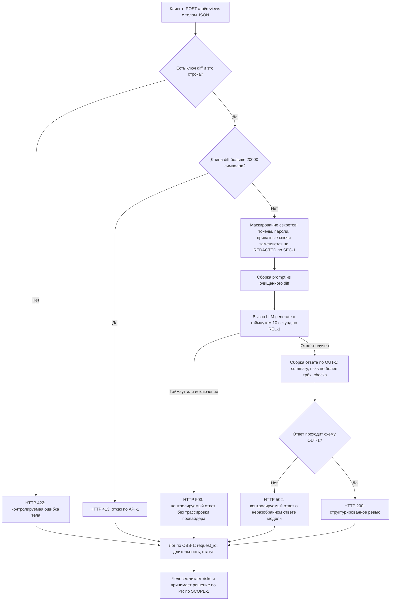

# Анализ процесса: AS IS и TO BE

Файл ведёт OpenCode. Обсудите с агентом содержание и проверьте предложенный diff. Все дополнения и исправления поручайте агенту в чате.

## AS IS

Клиент-интегратор отправляет `POST /api/reviews` с телом `{"diff": "<unified diff>"}`. FastAPI передаёт тело в обработчик `create_review(payload: dict) -> dict[str, str]`, объявленный в хунке `app/api.py @@ -1,8 +1,17 @@`. Обработчик состоит из одной строки — `return review_service.review(payload["diff"])`, — поэтому никакой ступени между приёмом тела и доменным сервисом нет: ни схемы запроса, ни проверки длины, ни аутентификации. Первая точка потери информации здесь же: если ключа `diff` в теле нет, обращение `payload["diff"]` возбуждает `KeyError`, который никто не перехватывает, и клиент вместо описания своей ошибки получает 5xx. Ошибка клиента и отказ сервиса становятся неразличимы (нарушение ожиданий, зафиксированных в `problem.md`).

Дальше управление уходит в `ReviewService.review(diff: str)` из хунка `app/review_service.py @@ -1,10 +1,23 @@`. Метод собирает `prompt = f"Review this pull request and find problems:\n{diff}"` — дифф подставляется в промпт дословно, без единого преобразования. Это вторая точка потери контроля: всё, что было в диффе, включая токены, пароли и приватные ключи, покидает контур и уходит внешнему провайдеру (нарушение SEC-1). Ручной операции, которая бы отсеяла такой дифф, в процессе нет — маскирование должно быть кодом, а кода в диффе нет.

Затем выполняется `answer = self.llm.generate(prompt)`. Вызов синхронный, без таймаута и без `try/except` — в приведённом хунке этих строк нет. Отсюда две задержки и один отказ: провайдер, отвечающий дольше десяти секунд, держит воркер сколько угодно долго (нарушение REL-1); провайдер, бросивший исключение, снова превращается в 5xx; длина `diff` при этом не ограничена, поэтому дорогой и медленный запрос может быть сколь угодно большим (нарушение API-1).

Наконец метод возвращает `{"comment": answer}`, и это значение уходит клиенту как есть. Третья точка потери информации: ответ LLM — свободный текст в единственном поле. Файл, строка, доказательство и формулировка риска, которые требует OUT-1, в нём, возможно, и присутствуют, но не выделены, поэтому CI-клиент не может их разобрать, а ревьюер вынужден читать текст целиком. Наблюдаемости у процесса тоже нет: логирования в диффе нет вообще, поэтому подтвердить соблюдение OBS-1 нечем — ни `request_id`, ни длительности, ни статуса.

## TO BE

Процесс после изменения показан ниже в нотации Mermaid flowchart: она рендерится в GitHub напрямую, поэтому отдельный исходник и PNG не нужны. Схема покрывает четыре ступени, которых нет в текущем коде, — валидацию тела, отсечение по длине (API-1), маскирование секретов (SEC-1) и вызов LLM с таймаутом (REL-1), — и заканчивается решением человека по SCOPE-1. Коды ответа 422, 502 и 503 на схеме — проектное решение этой работы, а не требование правил: `CASE.md` фиксирует только 413 для API-1, а REL-1 требует «контролируемый ответ», не называя кода.

## Разница

| Что меняется | AS IS | TO BE | Как проверим изменение |
|---|---|---|---|
| Валидация тела запроса | `return review_service.review(payload["diff"])` без проверок: тело `{}` даёт `KeyError` и 5xx | Тело без ключа `diff` отклоняется контролируемой 422 до вызова сервиса | `tests_unit.md` U-4 (вход `{}` → ошибка валидации, а не `KeyError`) и `tests_e2e.md` E-2 (наблюдаемый код 422) |
| Секреты в промпте | Дифф подставляется в f-строку как есть, значения токенов уходят провайдеру (SEC-1 нарушено) | Перед сборкой промпта секреты заменяются на `[REDACTED]` | `tests_unit.md` U-2: перехваченный `prompt` содержит `[REDACTED]` и не содержит значение токена |
| Ограничение длины диффа | Длина не проверяется, дифф любого размера уходит в LLM (API-1 нарушено) | Дифф длиннее 20 000 символов отклоняется с 413 до внешнего вызова | `tests_unit.md` U-3 (20 001 символ → отказ, `generate` не вызван) и `tests_e2e.md` E-3 (наблюдаемый код 413) |
| Отказоустойчивость LLM-вызова | `self.llm.generate(prompt)` без таймаута и `try/except`: исключение и зависание дают 5xx и держат воркер (REL-1 нарушено) | Вызов с таймаутом 10 с; исключение и таймаут превращаются в контролируемый 503 | `tests_integration.md` I-2 и I-3 (заглушка, бросающая исключение, и заглушка, отвечающая 11 с) |
| Контракт ответа | `{"comment": answer}` — одно строковое поле, разобрать нельзя (OUT-1 нарушено) | `{"summary": ..., "risks": [≤3 × {file, line, evidence, risk}], "checks": [...]}` | `tests_integration.md` I-4 и `tests_e2e.md` E-1 (тело ответа проходит схему) |
| Наблюдаемость | Логирования в хунках нет вообще, соблюдение OBS-1 подтвердить нечем | Пишутся `request_id`, длительность и статус; дифф и ответ модели в лог не попадают | `tests_integration.md` I-6: в перехваченном логе нет подстроки из диффа и текста ответа |

## Как использовали AI

- Для чего: описать текущий путь запроса по строкам диффа и собрать TO BE-схему, в которой каждая ветка соответствует конкретному правилу, а не общему представлению о «хорошем API».
- Тип промпта: master prompt (P1-03).
- Строка в [`prompts.md`](prompts.md): P1-03.
- Что проверили и исправили сами: сверили каждую фразу AS IS с текстом хунков — в частности, убедились, что `@app.get("/health")` в хунке `app/api.py` идёт как неизменённая строка контекста, поэтому не описывали её как часть нового процесса, и что переоформление сигнатуры `generate` в `app/review_service.py` не меняет поведения, поэтому не вносили его в таблицу «Разница». Отбросили как недоказуемый пункт про асинхронность маршрута: `def create_review` синхронный — это факт, но утверждение «воркеры исчерпаются» без замера остаётся гипотезой, поэтому в TO BE вошёл таймаут по REL-1, а не переход на async. В первой редакции под заголовком «## TO BE» осталась инструкция шаблона («Опишите один небольшой процесс…»): такую же строку в разделе AS IS я заменил содержанием, а вторую пропустил при вычитке — правка внутри одного файла вышла непоследовательной. Теперь там описание нотации и явная пометка, что коды 422, 502 и 503 — проектное решение, а не требование правил. Первая редакция также ссылалась на строки тестов пересказом заголовка («Маскирование секретов (SEC-1)» вместо «SEC-1 — маскирование секретов»), и шесть ссылок из девяти не совпадали с реальными названиями дословно. Чтобы ссылка не зависела от формулировки заголовка, в файлах тестов заведены короткие ID (U-1…U-6, I-1…I-7, L-1…L-4, E-1…E-6), и колонка «Как проверим изменение» ссылается на них; совпадение каждого ID с существующей строкой проверено скриптом, а не глазами.
