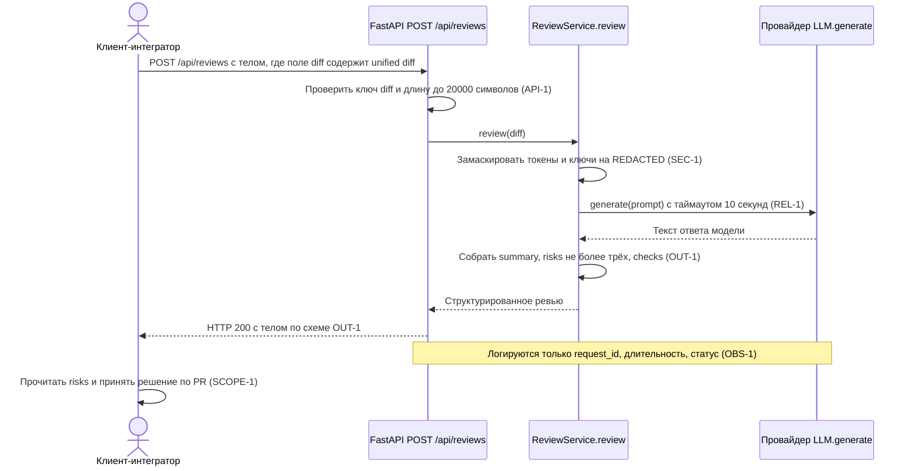

# Use cases и user stories

Файл ведёт OpenCode. Обсудите с агентом содержание и проверьте предложенный diff. Все дополнения и исправления поручайте агенту в чате.

## Первый рабочий сценарий

**Когда** клиент-интегратор отправляет `POST /api/reviews` с телом `{"diff": "<unified diff>"}`, **система** проверяет тело и длину диффа, маскирует секреты, вызывает LLM с таймаутом 10 секунд и собирает ответ по схеме OUT-1, **а пользователь получает** `summary`, не более трёх `risks` с полями `file`, `line`, `evidence`, `risk` и список `checks`, по которым сам принимает решение по PR.

Не входит в этот сценарий:

- approve, merge и любое изменение PR на стороне GitHub — сервис только советует (SCOPE-1);
- запись предложенного кода или патчей: ответ содержит риски и проверки, а не исправления (SCOPE-1);
- аутентификация, квоты и биллинг для `/api/reviews` — ни дифф, ни правила `CASE.md` их не задают;
- оценка качества формулировок, которые сгенерировал LLM: сценарий гарантирует форму ответа (OUT-1), а не его содержательную точность;
- маршрут `GET /health` — он в хунке `app/api.py @@ -1,8 +1,17 @@` присутствует как неизменённая строка контекста;
- ревью нескольких PR за один запрос: вход — один дифф в поле `diff`.

## Use case

| Поле | Значение |
|---|---|
| Актор | Клиент-интегратор `/api/reviews` (CI-джоб или ревьюер), решение по PR принимает человек (SCOPE-1) |
| Триггер | HTTP-запрос `POST /api/reviews` с телом `{"diff": "<unified diff>"}` |
| Предусловия | Приложение FastAPI поднято (`app = FastAPI()`, хунк `app/api.py @@ -1,8 +1,17 @@`); зависимость `review_service` доступна (`from app.dependencies import review_service`); провайдер за протоколом `LLM.generate(self, prompt: str) -> str` отвечает |
| Основной результат | HTTP 200 и тело по OUT-1: `summary`, `risks` (не более трёх элементов с `file`, `line`, `evidence`, `risk`), `checks`; в лог ушли только `request_id`, длительность и статус (OBS-1) |
| Ошибка или отказ | Тело без ключа `diff` → 422 (сейчас `payload["diff"]` даёт `KeyError` и 5xx); дифф длиннее 20 000 символов → 413 (API-1); таймаут 10 с или исключение LLM → 503 (REL-1); ответ модели, не разобранный в схему OUT-1 → 502. Во всех случаях — контролируемый ответ без трассировки провайдера, дифф и ответ модели в лог не пишутся (OBS-1) |



## User stories и acceptance criteria

```gherkin
Feature: Структурированное ревью диффа через POST /api/reviews

  Scenario: Позитивный — валидный дифф возвращает ответ по схеме OUT-1
    Given приложение FastAPI поднято и маршрут POST /api/reviews доступен
    And провайдер LLM за протоколом generate отвечает за 2 секунды
    When клиент отправляет POST /api/reviews с телом {"diff": "diff --git a/app/api.py b/app/api.py\n@@ -1,8 +1,17 @@\n+@app.post(\"/api/reviews\")"}
    Then код ответа равен 200
    And тело содержит строковое поле summary
    And тело содержит массив risks не более чем из трёх элементов
    And каждый элемент risks содержит поля file, line, evidence и risk
    And тело содержит массив checks
    And в логе присутствуют только request_id, длительность и статус

  Scenario: Негативный — тело без ключа diff отклоняется контролируемой ошибкой
    Given приложение FastAPI поднято и маршрут POST /api/reviews доступен
    When клиент отправляет POST /api/reviews с телом {}
    Then код ответа равен 422
    And тело содержит описание ошибки валидации с указанием отсутствующего поля diff
    And код ответа не равен 500
    And провайдер LLM не вызывался ни разу

  Scenario: Граничный — дифф в 20001 символ отклоняется по правилу API-1
    Given приложение FastAPI поднято и маршрут POST /api/reviews доступен
    When клиент отправляет POST /api/reviews с телом, в котором поле diff содержит 20001 символ
    Then код ответа равен 413
    And провайдер LLM не вызывался ни разу
    And в логе присутствуют только request_id, длительность и статус

  Scenario: Граничный — дифф ровно в 20000 символов принимается
    Given приложение FastAPI поднято и маршрут POST /api/reviews доступен
    And провайдер LLM за протоколом generate отвечает за 2 секунды
    When клиент отправляет POST /api/reviews с телом, в котором поле diff содержит 20000 символов
    Then код ответа равен 200
    And тело проходит схему OUT-1

  Scenario: Негативный — отказ провайдера LLM превращается в контролируемый ответ
    Given приложение FastAPI поднято и маршрут POST /api/reviews доступен
    And провайдер LLM за протоколом generate отвечает через 11 секунд
    When клиент отправляет POST /api/reviews с телом {"diff": "diff --git a/app/api.py b/app/api.py"}
    Then код ответа равен 503
    And тело не содержит трассировку стека и имя провайдера
    And в логе отсутствует содержимое diff и текст ответа модели
```

## Как использовали AI

- Для чего: развернуть один сквозной сценарий в use case, диаграмму последовательности и acceptance criteria так, чтобы каждый шаг ссылался на правило или на строку диффа.
- Тип промпта: master prompt (P1-03).
- Строка в [`prompts.md`](prompts.md): P1-03.
- Что проверили и исправили сами: перепроверили по хунку `app/api.py @@ -1,8 +1,17 @@`, что предусловием сценария является именно `from app.dependencies import review_service` — модуль `app/dependencies.py` в дифф не входит, поэтому в предусловиях он описан как доступная зависимость, а не как проверенный факт о его содержимом. Добавили граничный сценарий на ровно 20 000 символов, потому что API-1 отклоняет дифф «длиннее 20 000», и без парного сценария правило можно выполнить отсечением на 19 999. Отбросили как недоказуемый сценарий про повторные попытки при отказе провайдера: REL-1 требует контролируемый ответ, но ретраев не задаёт, а строк с ретраями в диффе нет.
