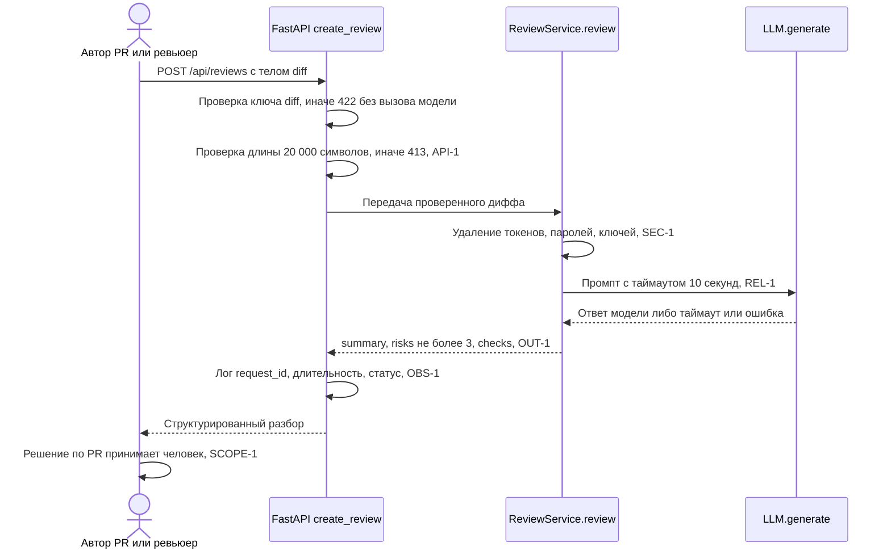

# Use cases и user stories

Сценарий один и тот же во всех артефактах: `POST /api/reviews`. Факты — из хунков `app/api.py @@ -1,8 +1,17 @@` и `app/review_service.py @@ -1,10 +1,23 @@`; правила — по ID (формулировки: [`context.md`](context.md), раздел «Факты и правила»).

## Первый рабочий сценарий

**Когда** автор PR или ревьюер отправляет `POST /api/reviews` с телом `{"diff": "<unified diff>"}` (маршрут объявлен строкой `@app.post("/api/reviews")`), **система** проверяет состав тела и длину диффа (не более 20 000 символов, API-1), удаляет из диффа токены, пароли и приватные ключи (SEC-1), вызывает модель с таймаутом 10 секунд (REL-1) и собирает результат в форму `summary` / `risks` / `checks` (OUT-1), **а пользователь получает** разбор, в котором не более трёх рисков, у каждого указаны `file`, `line`, `evidence`, `risk`, и решение по PR принимает сам (SCOPE-1).

Не входит в этот сценарий:

- запись кода в репозиторий, approve и merge PR — сервис только советует (SCOPE-1);
- изменение файлов в `app/` и самого `TRAINING_PR.diff`;
- аутентификация, квоты и тарификация запросов: такого правила среди SEC-1, API-1, REL-1, OUT-1, SCOPE-1, QA-1, OBS-1 нет, и строк об этом в хунках нет (QA-1);
- маршрут `@app.get("/health")`, возвращающий `{"status": "ok"}`: он присутствует в хунке `app/api.py @@ -1,8 +1,17 @@`, но к разбору диффа отношения не имеет.

## Use case

| Поле | Значение |
|---|---|
| Актор | Автор PR или ревьюер — единственный клиент маршрута `@app.post("/api/reviews")`; решение по PR остаётся за ним (SCOPE-1) |
| Триггер | HTTP-запрос `POST /api/reviews` с `Content-Type: application/json` и телом `{"diff": "<unified diff>"}` |
| Предусловия | Приложение поднято (`app = FastAPI()`), зависимость `review_service` доступна (`from app.dependencies import review_service`), провайдер за протоколом `class LLM(Protocol)` отвечает на `generate(prompt)` |
| Основной результат | Ответ вида `{"summary": "...", "risks": [...], "checks": [...]}`, где в `risks` не более трёх элементов с полями `file`, `line`, `evidence`, `risk` (OUT-1); по запросу записана строка лога с `request_id`, длительностью и статусом, без диффа и ответа модели (OBS-1) |
| Ошибка или отказ | Тело без ключа `diff` → контролируемый ответ 422, модель не вызывается (сейчас `payload["diff"]` даёт `KeyError`); дифф длиннее 20 000 символов → 413, модель не вызывается (API-1); таймаут 10 секунд или исключение провайдера → контролируемый ответ вместо необработанной ошибки (REL-1). Коды 422, 502 и 503 — проектное решение, зафиксированное в [`adr.md`](adr.md); правилами задан только 413 |



## User stories и acceptance criteria

История 1. Как ревьюер, я хочу получать разбор диффа в виде `summary`, `risks` и `checks`, чтобы работать по списку рисков, а не перечитывать одну строку `{"comment": ...}` (OUT-1).

История 2. Как автор PR, я хочу, чтобы некорректное или слишком длинное тело отклонялось до вызова модели, чтобы вместо необработанной ошибки получать понятный код ответа (API-1, текущая строка `payload["diff"]`).

История 3. Как владелец сервиса, я хочу, чтобы дифф не уходил во внешнюю модель вместе с секретами и чтобы вызов был ограничен по времени (SEC-1, REL-1).

```gherkin
Feature: Разбор диффа через POST /api/reviews

  Scenario: Позитивный
    Given приложение поднято и заглушка LLM возвращает строку "no critical problems found"
    When клиент отправляет POST /api/reviews с телом {"diff": "diff --git a/app/api.py b/app/api.py"} длиной 4 000 символов
    Then код ответа равен 200
    And тело ответа содержит ключи summary, risks и checks
    And длина массива risks не превышает трёх элементов
    And каждый элемент risks содержит поля file, line, evidence и risk
    And в строке лога есть request_id, длительность и статус, а подстроки диффа и ответа модели отсутствуют

  Scenario: Негативный или граничный
    Given приложение поднято и заглушка LLM считает число своих вызовов
    When клиент отправляет POST /api/reviews с телом {}
    Then код ответа равен 422
    And счётчик вызовов заглушки LLM остаётся равен нулю

    When клиент отправляет POST /api/reviews с диффом длиной 20 001 символ
    Then код ответа равен 413
    And счётчик вызовов заглушки LLM остаётся равен нулю

    When клиент отправляет POST /api/reviews с диффом длиной ровно 20 000 символов
    Then запрос принят к обработке и заглушка LLM вызвана один раз

    When клиент отправляет POST /api/reviews с корректным диффом, а заглушка LLM не отвечает 11 секунд
    Then клиент получает контролируемый ответ 503, а не необработанную ошибку
    And ожидание клиента не превышает 10 секунд плюс время сборки ответа
```

## Как использовали AI

- Для чего: описать один сквозной сценарий `POST /api/reviews` как use case и набор историй с критериями приёмки, сформулированными через вход и наблюдаемый результат.
- Тип промпта: master prompt.
- Строка в [`prompts.md`](prompts.md): P1-03.
- Что проверил студент и какие исправления поручил агенту: сверил предусловия и шаги с хунками — `@app.post("/api/reviews")`, `from app.dependencies import review_service`, `class LLM(Protocol)` присутствуют дословно. Поручил убрать историю про аутентификацию и лимиты запросов: ни одна строка хунков и ни одно правило её не подтверждают (QA-1). Поручил пометить коды 422 и 503 как проектное решение со ссылкой на [`adr.md`](adr.md), оставив ссылку на правило только у 413 (API-1). Поручил заменить критерий «модель не должна вызываться» на наблюдаемый счётчик вызовов заглушки, а также добавить граничный случай ровно 20 000 символов, чтобы порог проверялся с обеих сторон.
