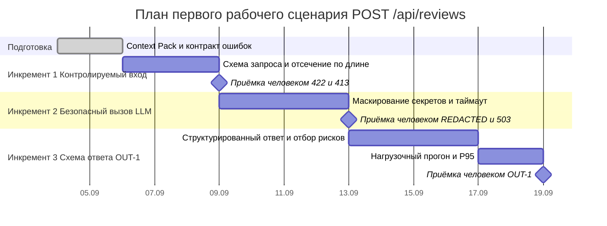

# План поставки

Роли распределены по SCOPE-1: решение, приёмка и оценка рисков — за человеком; AI-субагент готовит черновики и прогоняет проверки, но ничего не принимает. Персональный состав команды в четырёх источниках практики отсутствует, поэтому роли ниже названы по функции — это явное допущение.

## Инкременты и ответственность

| Инкремент | Наблюдаемый результат | Что делает человек | Что делает AI или субагент | Проверка | Зависимости |
|---|---|---|---|---|---|
| 1. Контролируемый вход | Запрос `POST /api/reviews` с телом `{}` возвращает 422 с указанием поля `diff`, а дифф в 20 001 символ — 413; ни один из них не доходит до провайдера LLM | Утверждает контракт ошибок (какой код на какой отказ), принимает результат по прогону E2E, решает, что 413 отдаётся до внешнего вызова, а не после | Готовит черновик схемы запроса и таблицу «код → причина», выписывает из диффа места, где сейчас происходит `KeyError`, прогоняет unit- и E2E-проверки и приносит отчёт | `tests_unit.md` U-4 и U-3; `tests_e2e.md` E-2 и E-3 | Правила API-1 и OUT-1 зафиксированы в `context.md`; факт `return review_service.review(payload["diff"])` из хунка `app/api.py @@ -1,8 +1,17 @@` |
| 2. Безопасный и ограниченный по времени вызов LLM | В промпте, ушедшем провайдеру, на месте токена стоит `[REDACTED]`; провайдер, отвечающий 11 секунд, даёт клиенту 503 за ~10 секунд вместо зависания; в логе только `request_id`, длительность и статус | Утверждает список категорий секретов, подлежащих маскированию, и принимает решение о поведении при таймауте (отказ, а не частичный ответ); оценивает остаточный риск пропущенного секрета | Собирает черновой набор шаблонов секретов и тест-диффы с ними, готовит заглушки LLM (бросающую исключение и отвечающую 11 секунд), прогоняет unit- и integration-проверки | `tests_unit.md` U-2; `tests_integration.md` I-2, I-3 и I-6 | Инкремент 1: до внешнего вызова доходят только валидные диффы допустимой длины |
| 3. Структурированный ответ по OUT-1 | Ответ 200 на валидный дифф содержит `summary`, `risks` (не более трёх, с `file`, `line`, `evidence`, `risk`) и `checks`; CI-клиент разбирает `risks` программно, ревьюер читает готовый список | Принимает схему ответа и правило отбора рисков по QA-1 (риск без evidence в ответ не попадает), проводит приёмку на реальном диффе и принимает решение по PR сам | Готовит черновик схемы OUT-1 и разбор ответа модели, генерирует набор ответов-нарушителей (четыре риска, риск без `evidence`), прогоняет integration-, E2E- и нагрузочные проверки | `tests_integration.md` I-4; `tests_e2e.md` E-1; `tests_load.md` L-1…L-4 | Инкременты 1 и 2: вход проверен, вызов ограничен по времени, секреты замаскированы |

## Диаграмма Ганта

Даты отсчитываются от 2026-09-04. Длительности — плановые оценки, а не замеренные: реальная скорость команды в источниках практики не зафиксирована, это допущение.

## Как использовали AI

- Для чего: разложить сквозной сценарий на три инкремента с наблюдаемыми снаружи результатами и развести ответственность человека и субагента по SCOPE-1.
- Тип промпта: master prompt (P1-03).
- Строка в [`prompts.md`](prompts.md): P1-03.
- Что проверили и исправили сами: переписали колонку «Наблюдаемый результат» — в черновике стояло «добавлена валидация» и «реализовано маскирование», то есть описание работы, а не наблюдаемого снаружи признака; заменили на конкретные коды ответа и содержимое промпта. Проверили, что в колонках человека и субагента не дублируется одно и то же действие: приёмка, утверждение контракта и оценка остаточного риска нигде не отданы AI. Пометили как допущение и состав команды, и длительности этапов — ни того, ни другого нет в `TRAINING_PR.diff`, `CASE.md`, `README.md` и `Makefile`, поэтому конкретные имена и сроки в план не подставлялись.
