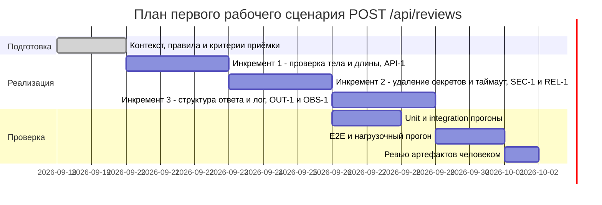

# План поставки

План покрывает один сценарий — `POST /api/reviews`. Основание для каждого инкремента: строка хунка `app/api.py @@ -1,8 +1,17 @@` или `app/review_service.py @@ -1,10 +1,23 @@` либо ID правила (формулировки — в [`context.md`](context.md), раздел «Факты и правила»).

## Инкременты и ответственность

| Инкремент | Наблюдаемый результат | Что делает человек | Что делает AI или субагент | Проверка | Зависимости |
|---|---|---|---|---|---|
| 1. Проверка тела и длины диффа на входе | Тело `{}` даёт 422, дифф 20 001 символ даёт 413 (API-1), дифф 20 000 символов принимается; в обоих отказах модель не вызывается. Устраняет `KeyError` на строке `return review_service.review(payload["diff"])` | Утверждает коды ответов для пустого тела (422 — проектное решение, см. [`adr.md`](adr.md)), подтверждает способ подсчёта длины и принимает инкремент | Готовит описание проверок и формулирует критерии приёмки; кода в `app/` не пишет (SCOPE-1) | Тело `{}` → 422 и счётчик вызовов заглушки LLM равен нулю; дифф 20 001 символ → 413 и счётчик равен нулю; дифф 20 000 символов → счётчик равен единице ([`tests_e2e.md`](tests_e2e.md)) | Нет: опирается только на хунк `app/api.py @@ -1,8 +1,17 @@` и правило API-1 |
| 2. Удаление секретов и таймаут LLM-вызова | В перехваченном аргументе `prompt` нет значений токенов, паролей и приватных ключей (SEC-1); вызов, длящийся дольше 10 секунд, и исключение провайдера превращаются в контролируемый ответ (REL-1) вместо необработанной ошибки на строке `answer = self.llm.generate(prompt)` | Утверждает перечень шаблонов секретов для SEC-1 и код ответа при таймауте (503 — проектное решение, см. [`adr.md`](adr.md)); принимает инкремент | Описывает набор проверок на перехваченном аргументе и на заглушке с задержкой; решение по PR не принимает (SCOPE-1) | Дифф со строкой `AWS_SECRET_ACCESS_KEY=AKIAEXAMPLE` → в аргументе `prompt` подстроки `AKIAEXAMPLE` нет ([`tests_unit.md`](tests_unit.md)); заглушка молчит 11 секунд → контролируемый ответ, ожидание не превышает 10 секунд плюс сборка ответа ([`tests_integration.md`](tests_integration.md)) | Инкремент 1: до модели должны доходить только проверенные тела, иначе таймаут проверяется на некорректном входе |
| 3. Структура ответа по OUT-1 и логирование по OBS-1 | Ответ содержит `summary`, `risks`, `checks`, в `risks` не более трёх элементов с полями `file`, `line`, `evidence`, `risk` вместо текущего `return {"comment": answer}`; по каждому запросу в логе есть `request_id`, длительность и статус, а диффа и ответа модели в логе нет (OBS-1) | Утверждает формулировку `summary` и порядок сортировки `risks`, проверяет на глазах одну запись лога и принимает инкремент | Описывает сборку ответа и состав строки лога, формулирует проверки; в GitHub не действует (SCOPE-1) | Корректный дифф → в теле три ключа и `len(risks) <= 3`, у каждого элемента четыре поля; после запроса с диффом-маркером в логе есть три поля, подстроки маркера и текста ответа модели отсутствуют ([`tests_integration.md`](tests_integration.md), [`tests_e2e.md`](tests_e2e.md)) | Инкременты 1 и 2: структура ответа и статус в логе определены в том числе для отказов 413, 422 и 503 |

## Диаграмма Ганта

Даты — допущение планирования (в хунках и правилах календаря нет); заменяются на календарь команды при старте работ. Длительности заданы в днях и отражают порядок зависимостей из таблицы выше, а не измеренную трудоёмкость.

Порядок инкрементов задан зависимостями, а не оценкой срока: проверка входа идёт первой, потому что без неё таймаут и структура ответа проверялись бы на непроверенном теле, которое сейчас роняет обработчик на `payload["diff"]`.

## Как использовали AI

- Для чего: разложить работы по одному сценарию `POST /api/reviews` на три инкремента с наблюдаемым результатом и проверкой у каждого, а также оформить их последовательность на диаграмме.
- Тип промпта: master prompt.
- Строка в [`prompts.md`](prompts.md): P1-03.
- Что проверил студент и какие исправления поручил агенту: сверил основания инкрементов с хунками и убедился, что каждый опирается на цитату или ID правила. Поручил пометить даты на диаграмме как допущение планирования с условием замены — календаря нет ни в хунках, ни в правилах. Поручил убрать из таблицы оценки трудозатрат в часах: их нечем подтвердить (QA-1). Поручил переписать колонку «Проверка» так, чтобы в каждой строке был конкретный вход и наблюдаемый критерий, а не название набора тестов. Проверил, что колонка «Что делает AI» нигде не содержит написания кода и действий в GitHub (SCOPE-1).
